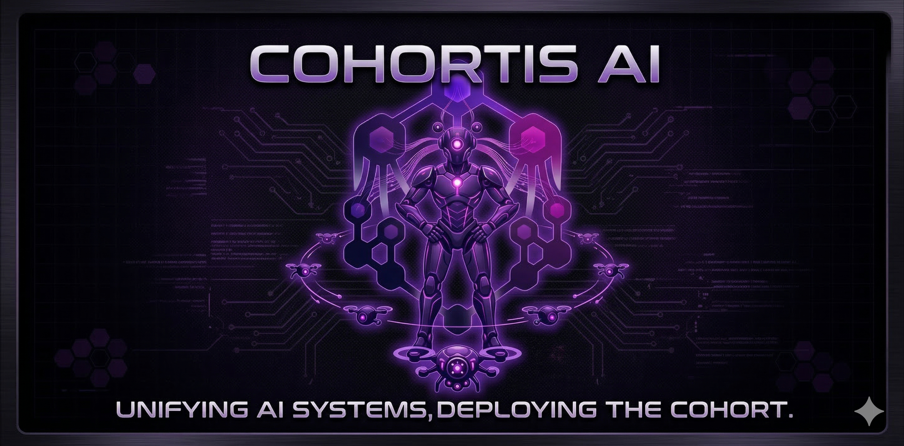
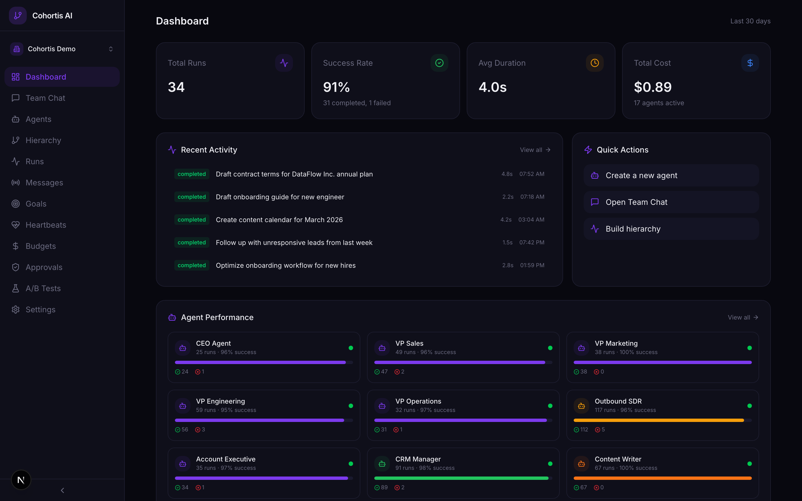
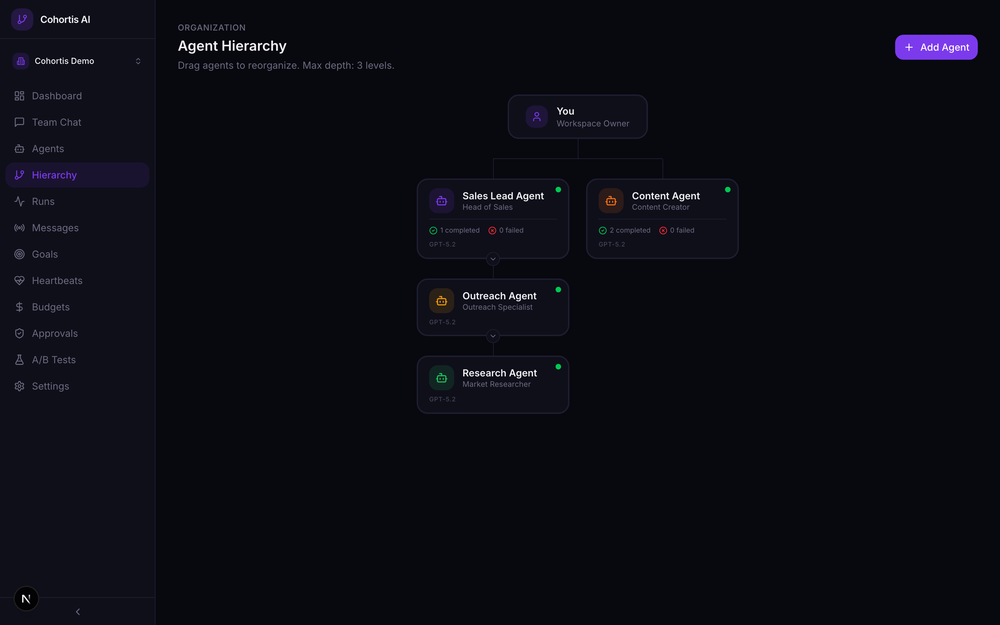
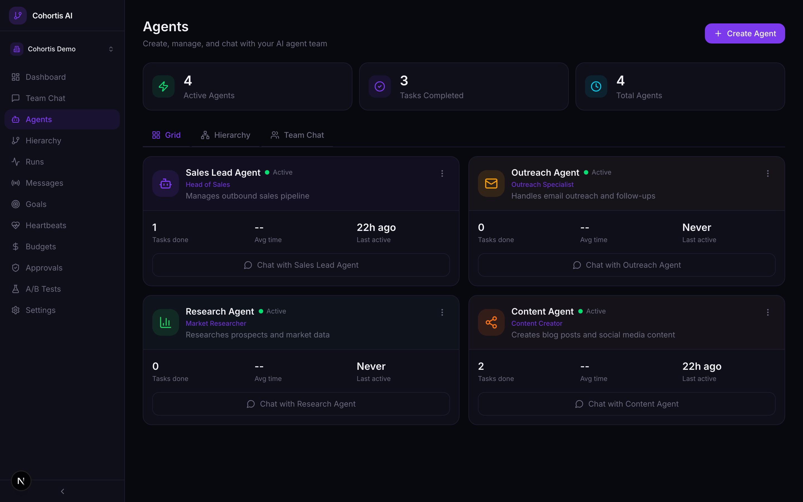
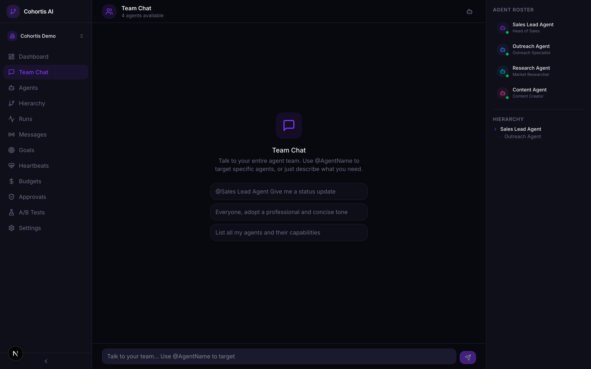

<p align="center">
  
</p>

<div align="center">

**Deploy AI agent teams that organize, collaborate, and improve themselves.**

[Website](https://cohortis.ai) · [Getting Started](#-getting-started) · [Features](#-features) · [Architecture](#-architecture) · [Roadmap](#-roadmap) · [License](LICENSE)

[](LICENSE)
[](https://nextjs.org)
[](https://typescriptlang.org)
[](https://sdk.vercel.ai)
[](https://orm.drizzle.team)
[](https://neon.tech)

</div>

<br />

<p align="center">
  
</p>

<br />

## Why Cohortis?

Today's AI agent tools are either **static config files** (no learning, no collaboration) or **code frameworks** (powerful but dev-heavy). Neither gives you agent teams that **get better over time**.

Cohortis is the missing layer: a platform where agents are organized in a **hierarchy with real authority** — just like a human organization. Lead agents supervise managers. Managers delegate to executors. Parent agents rewrite child prompts based on performance. The entire system learns from every run.

```
Lead Agent (Strategic)
  ├── Manager Agent (Coordination)
  │     ├── Executor Agent (Email)
  │     └── Executor Agent (Calendar)
  └── Manager Agent (Analysis)
        ├── Executor Agent (Data)
        └── Executor Agent (Reports)
```

> [!NOTE]
> **Used in production by [Fleece AI](https://fleeceai.app)** — Autonomous AI Agents & AI Workflow platform with 3,000+ app integrations serving thousands of users. Fleece AI's autonomous agent teams are powered by the Cohortis engine.

<br />

## ✦ Features

### Dynamic Agent Hierarchy

Create multi-level agent teams that mirror real org structures. Lead agents supervise and correct child agents. Delegation follows the chain of command with configurable depth control.

<p align="center">
  
</p>

<br />

### Agent Management & Observability

Full agent lifecycle: create, configure, monitor, and chat with each agent directly. Per-agent KPIs, execution timelines, token usage, and cost tracking — know exactly what every agent is doing and why.

<p align="center">
  
</p>

<br />

### Team Chat

Natural language interface to interact with your entire agent team. Use `@AgentName` to delegate tasks to specific agents, or let the orchestrator route your request to the right one.

<p align="center">
  
</p>

<br />

### All Capabilities

| | Feature | Description |
|:--|:--|:--|
| 🔗 | **Dynamic Hierarchy** | Multi-level agent teams with parent-child relationships, delegation chains, depth control |
| 🧬 | **Self-Optimizing Prompts** | A/B test prompt variants per agent, track success rates, auto-deploy the best performer |
| 🧠 | **Shared Memory** | Three context layers — mission (current task), team (shared knowledge), org (company-wide) |
| 📊 | **Deep Observability** | Reasoning traces, per-agent KPIs, execution timelines, token & cost tracking |
| 🎯 | **OKR-Style Goals** | Hierarchical goal trees with parent-child relationships, assign to agents, track progress |
| ⏱ | **Heartbeat Scheduling** | Agents wake on configurable intervals (5 min → 24h) to autonomously check for work |
| 💰 | **Per-Agent Budgets** | Monthly USD limits per agent, auto-throttle at 100%, configurable warning thresholds |
| 🛡 | **Approval Gates** | Human review for critical actions: budget overrides, prompt changes, external actions |
| 🌐 | **BYOA** | Bring Your Own Agent — connect external agents via HTTP webhook into the hierarchy |
| 🤖 | **Multi-Model** | GPT-5.2, Claude Opus 4.6, Claude Sonnet 4.6, GPT-4o Mini — right model per role |
| 💬 | **Team Chat** | Talk to your agent team with `@mentions`, auto-routing, and full conversation history |
| 📈 | **A/B Testing Dashboard** | Visual prompt performance comparison, statistical significance, one-click deploy |

<br />

## 🆚 Comparison

| Capability | Cohortis AI | Static Config | Code Frameworks | Single-Vendor |
|:--|:--:|:--:|:--:|:--:|
| Agent hierarchy | ✅ | ❌ | ⚠️ manual | ❌ |
| Self-improving prompts | ✅ | ❌ | ❌ | ❌ |
| Shared memory | ✅ | ❌ | ⚠️ limited | ⚠️ limited |
| Budget controls | ✅ | ❌ | ❌ | ❌ |
| Approval gates | ✅ | ❌ | ❌ | ❌ |
| BYOA (external agents) | ✅ | ❌ | ⚠️ custom | ❌ |
| Multi-model | ✅ | ⚠️ | ✅ | ❌ |
| No-code management | ✅ | ❌ | ❌ | ⚠️ |
| Open source | ✅ | ✅ | ✅ | ❌ |

<br />

## 🚀 Getting Started

### Prerequisites

- **Node.js** 20+
- **PostgreSQL** — we recommend [Neon](https://neon.tech) (serverless, free tier available)
- **OpenAI** and/or **Anthropic** API keys

### Quick Setup

```bash
# Clone & install
git clone https://github.com/Cohortis-AI/cohortis-ai.git
cd cohortis-ai
pnpm install

# Configure
cp .env.example .env.local
# Edit .env.local with your credentials (see below)

# Push schema & run
pnpm db:push
pnpm dev
```

Open **[http://localhost:3000](http://localhost:3000)** — you're in.

> [!TIP]
> For local development without OAuth, set `DISABLE_AUTH=true` in your `.env.local` to bypass authentication.

<details>
<summary><strong>Environment Variables</strong></summary>

<br />

| Variable | Required | Description |
|:--|:--:|:--|
| `POSTGRES_URL` | ✅ | Neon/PostgreSQL connection string |
| `AUTH_SECRET` | ✅ | NextAuth.js secret (`openssl rand -base64 32`) |
| `AUTH_URL` | ✅ | Your app URL (e.g. `http://localhost:3000`) |
| `OPENAI_API_KEY` | ✅ | OpenAI API key |
| `ANTHROPIC_API_KEY` | | Anthropic API key (for Claude models) |
| `GOOGLE_CLIENT_ID` | | Google OAuth client ID |
| `GOOGLE_CLIENT_SECRET` | | Google OAuth secret |
| `GITHUB_CLIENT_ID` | | GitHub OAuth client ID |
| `GITHUB_CLIENT_SECRET` | | GitHub OAuth secret |
| `CRON_SECRET` | | Secret for heartbeat cron endpoint |
| `DISABLE_AUTH` | | Set `true` to bypass auth in dev |

</details>

<br />

## 🏗 Architecture

### Tech Stack

| Layer | Technology |
|:--|:--|
| **Framework** | Next.js 15 (App Router, Turbopack) |
| **Language** | TypeScript 5 |
| **AI** | Vercel AI SDK v4 (multi-provider) |
| **Database** | PostgreSQL via Neon (serverless) |
| **ORM** | Drizzle ORM |
| **Auth** | NextAuth.js v5 |
| **UI** | Tailwind CSS, Lucide Icons |
| **State** | SWR (client) + React Server Components |

### Project Structure

```
cohortis-ai/
├── app/
│   ├── (app)/                    # Authenticated app pages
│   │   ├── dashboard/            # Overview & KPIs
│   │   ├── agents/               # Agent CRUD + detail views
│   │   ├── hierarchy/            # Visual hierarchy management
│   │   ├── team-chat/            # Agent team chat interface
│   │   ├── ab-tests/             # A/B testing dashboard
│   │   ├── goals/                # OKR goal trees
│   │   ├── heartbeats/           # Scheduling configuration
│   │   ├── budgets/              # Budget management
│   │   ├── approvals/            # Approval queue
│   │   └── runs/                 # Execution history & traces
│   └── api/                      # REST API (25+ routes)
├── lib/
│   ├── agents/
│   │   ├── executor.ts           # Main agent execution loop
│   │   ├── external-executor.ts  # BYOA webhook executor
│   │   ├── hierarchy-tools.ts    # Delegation & reporting
│   │   ├── ab-selector.ts        # A/B variant selection
│   │   ├── ab-deploy.ts          # Auto-deploy winning variants
│   │   └── budget.ts             # Budget check & spend recording
│   ├── db/
│   │   ├── schema.ts             # Drizzle schema (16 tables)
│   │   └── queries.ts            # All database operations
│   ├── workspace/context.ts      # Shared memory system
│   ├── team-chat/                # Chat orchestration & delegation
│   └── notifications/            # Real-time event system
├── components/                   # Reusable UI components
└── scripts/                      # Dev tools & test suite
```

### Database — 16 Tables

```
Auth                Workspaces            Agents                Optimization
────────────        ──────────────        ────────────          ────────────────
users               workspaces            agents                prompt_variants
accounts            workspace_members     agent_runs            ab_test_runs
sessions                                  agent_messages
verification_tokens

Operations          Integrations
──────────────      ────────────
goals               integrations
heartbeats
agent_budgets
approval_gates
```

<br />

## 🗺 Roadmap

- [ ] Visual workflow builder (drag & drop agent hierarchies)
- [ ] Agent marketplace (share & import agent templates)
- [ ] Multi-tenant SaaS mode
- [ ] Webhooks for external event triggers
- [ ] Advanced analytics dashboard with anomaly detection
- [ ] Plugin system for custom tools
- [ ] Mobile app for approvals & monitoring

<br />

## 🏢 Who Uses Cohortis?

<table>
<tr>
<td align="center" width="120">
<br />
<a href="https://fleeceai.app">

</a>
<br /><br />
</td>
<td>
<a href="https://fleeceai.app"><strong>Fleece AI</strong></a>
<br />
Autonomous AI Agents & AI Workflow platform with <strong>3,000+ app integrations</strong> serving thousands of users. Uses Cohortis for autonomous AI agent teams that handle email, calendar, data analysis, and more.
</td>
</tr>
</table>

*Using Cohortis AI? [Open a PR](https://github.com/Cohortis-AI/cohortis-ai/pulls) to add your project.*

<br />

## 🤝 Contributing

Contributions welcome! Fork the repo, create a branch, and submit a PR.

```bash
pnpm dev          # Dev server
pnpm build        # Production build
pnpm lint         # Lint
pnpm tsc --noEmit # Type-check
```

<br />

## 📄 License

[MIT](LICENSE) — use it for anything.

<br />

---

<div align="center">

**Cohortis AI** — from Latin *cohortis* (cohort, organized unit)

Built with conviction that AI agents work better as teams.

<br />

[⬆ Back to top](#cohortis-ai)

</div>
